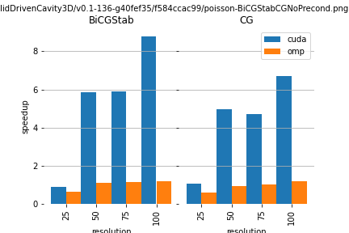
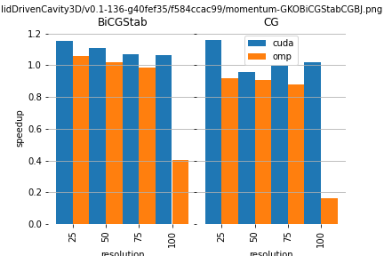

# Benchmark results

## Speedup OpenFoam vs Ginkgo Backend

## Speedup Unpreconditioned vs Preconditioned with Ginkgo Backend

## Speedup of Different Solver vs CG  with Ginkgo Backend

## Speedup Unpreconditioned vs Preconditioned with OpenFOAM Backend

